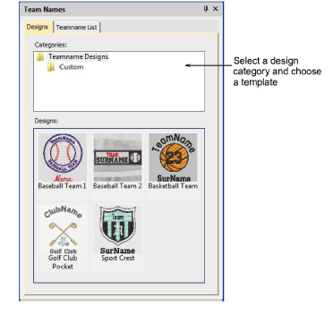
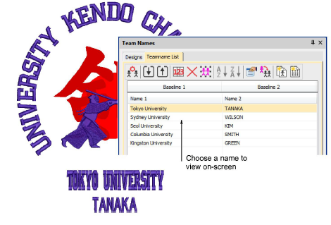
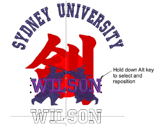
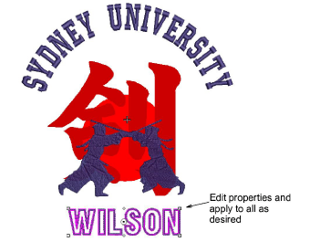

# Use templates with teamname designs

|  | Use Toolbox or Docker > Team Names to select a layout for your teamname design. |
| ------------------------------------------------ | ------------------------------------------------------------------------------- |

When creating teamname designs, you can use a preset layout or a custom layout based on artwork you may have received.

## To use a template with a teamname design...

- Open the design you want to use.

- Click the Team Names icon to access the docker and choose the Designs tab. This tab includes template samples as well as any custom designs saved as teamname templates. These may contain more than one baseline.

- Choose a template on which to base your intended layout.
- If you haven’t already entered the names, switch to the Teamname List and key in or import the names to use. The sample below uses two sets of names on separate baselines.

- Press G to generate stitching and use arrow keys to ‘nudge’ the lettering into position.
- Use the Teamname List to select and view individual team members.
- To reposition or modify a lettering object within a teamname object, first hold down the Alt key and click to select it.

- Edit lettering object properties as desired.

## Related topics...

- [Select objects within groups](../../Modifying/combine/Select_objects_within_groups)
- [Modifying teamname designs](Modifying_teamname_designs)
