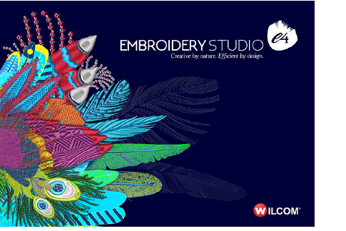

# Product Differentiation

EmbroideryStudio consists of five standard product models with over 20 optional ‘Elements’. Standard products are powerful, well featured, professional embroidery applications. Additional Elements are available at extra-cost. Some Elements are provided as standard in higher product models.

## Related topics

- [Product differentiation table](../prodiff_table/Product_differentiation_table)
- [Modular elements](../elements/Modular_elements)
