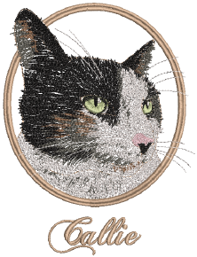

# File Management

EmbroideryStudio allows you to create files or ‘assets’ of various kinds during normal use. The most important of these are your actual embroidery designs. But there are other assets you may create, such as design templates, custom motifs and borders. These are preserved from installation to installation, whether installing a new version of EmbroideryStudio or a software update.

## Design management

Design Library is a design management tool. Use it to browse design and artwork files stored on your local PC or company network. Design Library capabilities make it fast and practical for daily commercial use, avoiding the need to switch to and from File Explorer. It recognizes all file formats used by EmbroideryStudio. It also makes it easy to search, sort and browse all embroidery designs on your network. [See Design Management for details.](../manage_designs/Design_Management)

## Asset management

It’s a good idea to familiarize yourself with the locations and file names of your custom assets as a protection in case of computer crash, in order to share assets, and in cases where you need to manually copy the contents of your asset folders to the new locations. [See Asset Management for details.](../manage%5Fassets/Asset%5FManagement#XREF%5F53800%5FManaging%5FAssets)

## Product templates

EmbroideryStudio allows you to choose a garment or product backdrop on which to position designs and decorations. This feature is mainly used to display location, size and overall appearance for visualization and customer approval purposes. You can add your own single-color and multi-color product templates to the software by following the method outlined in this section. [See Product Visualizer Templates for details.](../product_templates/Product_Visualizer_Templates)

## Standard fonts

The tables in this section display all embroidery fonts that are standard with EmbroideryStudio. [See Standard Fonts for details.](../sample_fonts/Standard_Fonts)

## Custom fonts

EmbroideryStudio provides options for creating custom embroidery fonts. You can create entire embroidery fonts from converted TrueType fonts. You can digitize letters from [backdrop](../../glossary/glossary) images, convert [vector objects](../../glossary/glossary), or digitize freehand using any of the input methods. You can use [artwork](../../glossary/glossary) from sources such as calligraphy books or TrueType fonts. [See Custom Fonts for details.](../custom_fonts/Custom_Fonts)

## Machine, file & disk types

This section provides details of the file and disk types supported by EmbroideryStudio. Details are also provided about the conversion of Melco CND, Wilcom INP, and Gunold PCH design formats to and from [EMB](../../glossary/glossary). The section also provides details of vector and bitmap (raster) formats. [See Machine, File & Disk Types for details.](../formats/Machine_File_Disk_Types)
