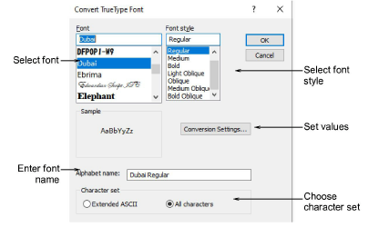
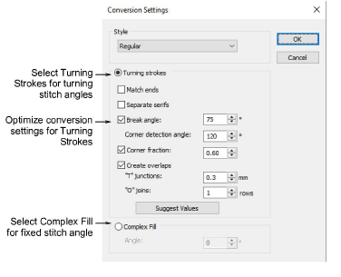
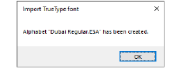
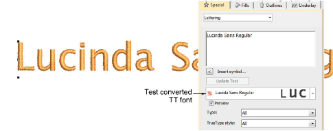

# Convert entire TrueType font

Once you have arrived at conversion settings that suit your chosen TrueType font, go ahead and convert the entire font. Custom fonts are saved in ESA format to the ‘Fonts’ folder within the Windows ‘ProgramData’ folder. Conversion happens quickly although Asian fonts may take longer. They can be copied and distributed for use by others.

## To convert a TrueType font...

1Select Setup > Convert TrueType Font. The Convert TrueType Font dialog opens.

2Select the font to be converted together with a font style – e.g. Regular, Bold, Italic. The entire embroidery font will be created in the selected style.

3Enter a Font Name if you want to override the default.

4Choose whether to convert All Characters or Extended ASCII character sets. The standard character set contains alphanumeric characters only. It excludes punctuation marks and other special characters.

5Click Conversion Settings. As always, these can be further refined.

6Adjust settings according to your experiments with on-the-fly font conversion.

7Click OK. A confirmation will appear when the process is complete.

8To check, right-click the Lettering icon to open the Object Properties > Special > Lettering docker. The newly converted font will be selected by default and available for use.

## Related topics...

- [Create lettering with object properties](../../Lettering/lettering_create/Create_lettering_with_object_properties)
- [Custom asset locations](../manage%5Fassets/Custom%5Fasset%5Flocations#XREF%5F78115%5FCustom%5Fasset)
