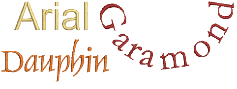

# Converting & editing TrueType fonts

The simplest option for creating custom embroidery fonts is to use the built-in Convert TrueType Font feature. This lets you convert any TrueType font installed on your system to an embroidery font.

The process is fully automatic. Lettering shapes are ‘cut’ into [Column A](../../glossary/glossary) or [Column B](../../glossary/glossary) embroidery objects. Overlaps and stroke order are detected and [stitch angles](../../glossary/glossary) defined. The result is similar to manually digitized fonts although the quality may not be quite as good. The quality greatly depends on the original shapes, narrower serif type fonts producing better results than blocked fonts.

## Related topics...

- [Experiment with conversion settings](Experiment_with_conversion_settings)
- [Refine turning stroke options](Refine_turning_stroke_options)
- [Convert entire TrueType font](Convert_entire_TrueType_font)
- [Edit & repackage generated letters](Edit_repackage_generated_letters)
