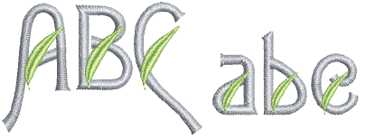

# Creating multicolor fonts

Lettering objects normally consist of one stitch type and one color only. However, the As Digitized join method can be used to create special fonts with multiple colors or special effects. We will now use this method to create a variation of our custom font by adding an embellishment to each letter.

## Related topics...

- [Import the embroidery ornament](Import_the_embroidery_ornament)
- [Edit the font](Edit_the_font)
- [Save custom font & letters](Save_custom_font_letters1)
- [Test the font](Test_the_font1)
