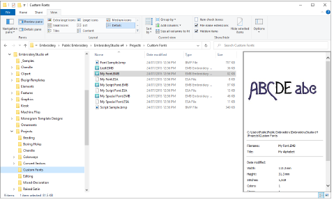

# Custom Fonts

EmbroideryStudio provides options for creating custom embroidery fonts. You can create entire embroidery fonts from converted TrueType fonts. You can digitize letters from [backdrop](../../glossary/glossary#backdrop) images, convert [vector objects](../../glossary/glossary), or digitize freehand using any of the input methods. You can use [artwork](../../glossary/glossary#artwork) from sources such as calligraphy books or TrueType fonts.

In this section we show how to convert and modify TrueType fonts. We digitize embroidery lettering from scratch for inclusion as a custom font. We adapt an existing font to a decorative, multicolor font. We also take a script font and turn it into a custom embroidery font.

::: tip
Source files and sample custom fonts used in this section are included in the Projects > Custom Fonts folder.
:::

## Related topics...

- [Font considerations](Font_considerations)
- [Converting & editing TrueType fonts](Converting_editing_TrueType_fonts)
- [Digitizing custom fonts](Digitizing_custom_fonts)
- [Creating multicolor fonts](Creating_multicolor_fonts)
- [Digitizing script fonts](Digitizing_script_fonts)
