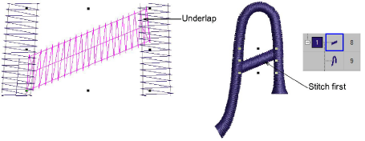

# Digitize the letters

|              | Use Traditional Digitizing > Column A to create columns of varying width and stitch angle. Right-click for settings.        |
| -------------------------------------------- | --------------------------------------------------------------------------------------------------------------------------- |
|        | Use Fill Stitch Types > Satin to apply satin stitch to new or selected narrow columns and shapes. Right-click for settings. |
|  | Use Outline Stitch Types > Satin to create thicker borders or columns of even thickness. Right-click for settings.          |

In this project we are going to create sample letters using uppercase A, B, C and lowercase a, b and c. Start digitizing letters using Column A with Satin stitch. Make sure you create sufficient underlap to bind letter strokes together. No underlay or pull compensation is required. This is added when you create actual lettering with the custom font. Make sure you strokes are digitized in the sequence they will be stitched out. Generally, you don’t need to worry about connections between strokes. This is automatically handled when packing the font.

::: tip
Use Vector tools to draw guidelines for more accurate digitizing.
:::

## Related topics...

- [Creating custom fonts](../../Lettering/lettering_custom/Creating_custom_fonts)
