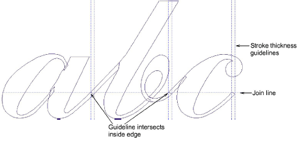

# Digitize the letters

|              | Use Traditional Digitizing > Column A to create columns of varying width and stitch angle. Right-click for settings.        |
| ------------------------------------------------------ | --------------------------------------------------------------------------------------------------------------------------- |
|        | Use Fill Stitch Types > Satin to apply satin stitch to new or selected narrow columns and shapes. Right-click for settings. |
|  | Use Outline Stitch Types > Satin to create thicker borders or columns of even thickness. Right-click for settings.          |

Digitize letters as you did the custom font. For script fonts, the tail of each letter has to coincide with the initial stroke of the next in order to create a seamless join. Drag a guideline into position to mark the ‘join line’.

Drag a guideline to intersect the join line on the inside edge of the stroke. Turn on ‘Snap to Guides’ in the Options > Grids & Guides tab. Make sure reference points of adjacent letters coincide with this point.

The join edge should be approximately perpendicular to the slope. No need for overlap on narrow strokes as pull compensation will provide sufficient overlap.

Don’t worry about connecting stitches between objects. EmbroideryStudio automatically handles this when you save with the Closest Join method.
