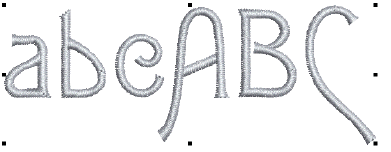

# Digitizing custom fonts

You digitize letters for a custom font just like other embroidery objects. Custom letters can be made up of multiple objects, and may be letters, numbers, symbols or even pictures. We will be creating a font for a nominal height of 20 mm.

## Related topics...

- [Set fabric, background & machine format](Set_fabric_background_machine_format)
- [Set up grid & guides](Set_up_grid_guides)
- [Import & size the backdrop](Import_size_the_backdrop)
- [Digitize the letters](Digitize_the_letters)
- [Save custom font & letters](Save_custom_font_letters)
- [Test the font](Test_the_font)
