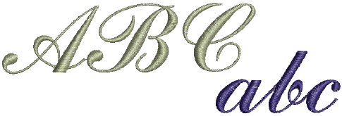

# Digitizing script fonts

Now we are going to make a script font. Certain digitizing rules apply when creating script fonts, mainly to ensure that the tail of each letter joins seamlessly with the next letter.

## Related topics...

- [Set fabric, background & machine format](Set_fabric_background_machine_format1)
- [Import & size the backdrop](Import_size_the_backdrop1)
- [Digitize the letters](Digitize_the_letters1)
- [Save custom font & letters](Save_custom_font_letters2)
- [Test the font](Test_the_font2)
