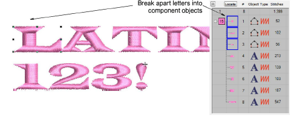

# Edit & repackage generated letters

|              | Use Edit > Break Apart to split composite objects – monograms, appliqués, lettering, etc – into component objects.  |
| ---------------------------------------------------- | ------------------------------------------------------------------------------------------------------------------- |
|        | Use Reshape > Reshape Object to reshape selected objects by means of control points.                                |
|                        | Use Edit > Knife to cut objects along a digitized line, preserving stitch settings and colors in resulting objects. |
|  | Use Arrange > Apply Closest Join to (re-)apply closest join to objects after editing.                               |

The process of TrueType font conversion is fully automatic. Lettering shapes are ‘cut’ into [Column A](../../glossary/glossary) or [Column B](../../glossary/glossary) objects. Overlaps and stroke order are detected and [stitch angles](../../glossary/glossary) defined. If you find that some shapes can be improved, you have the option of editing and repackaging individually.

## To edit & repackage generated letters...

1. First set up a grid and save the file for future reference. Whenever you need to fix or edit characters, the grid helps with reference.

Set up grid spacing in the Options dialog via Setup > Options > Grid & Guides. Turn on Snap to Guides. Set vertical spacing to 10mm and horizontal spacing to 0.50 mm.

2. Generate a sample and study the letters. The complete font set depends on whether you have chosen to convert All Characters or Extended ASCII. The standard character set contains alphanumeric characters only.

Tip: You only need to generate those characters that you want to edit and repackage. You can do this over time.

3. Note the lettering height. Normally this will default to 10mm but set it to whatever height you prefer to work with.

4. Before you start editing, turn off underlay. When you repackage, characters should be without underlay.

5. Break apart the font, line-by-line and letter-by-letter, until you arrive at the component objects.

6. Zoom in to edit letter shapes with the Reshape Object and Knife tools.

- Typically you will want to add or remove control points, adjust overlaps, and resequence component objects.

- Optionally, you may use the Knife tool to cut objects into smaller overlapping strokes for better stitchability.

7. When you have edited the letter to your satisfaction, select all component objects and apply closest join.

8. Repackage the edited letter to the converted embroidery font. Select letter components and save using the Object > Create Letter command.

9. In the dialog, specify...

| Field            | Action                                                        |
| ---------------- | ------------------------------------------------------------- |
| Font name        | Select the converted font from the droplist.                  |
| Letter name      | This should be the actual character – e.g. ‘L’.               |
| Reference height | This needs to be the height of the sample letter – e.g. 10mm. |

10. Click OK. The following warning will appear...

11. Click Yes to proceed and enter a reference line as prompted.

12. Add any other modified letters to your converted TrueType font in the same way.

13. Test your updated font via Object Properties > Lettering. Note that changes are preserved and underlay automatically added to the repackaged characters. Test at different font heights.

## Related topics...

- [Breaking apart lettering](../../Lettering/lettering_edit/Breaking_apart_lettering)
- [Splitting objects](../../Modifying/reshape/Splitting_objects)
- [Reshape letters](../../Lettering/lettering_edit/Reshape_letters)
- [Apply closest join](../../Quality/connectors/Apply_closest_join)
- [Create custom letters](../../Lettering/lettering_custom/Create_custom_letters)
- [Save custom letters](../../Lettering/lettering_custom/Save_custom_letters)
- [Save custom fonts](../../Lettering/lettering_custom/Save_custom_fonts)
- [Manage fonts](../../Lettering/lettering_custom/Manage_fonts)
