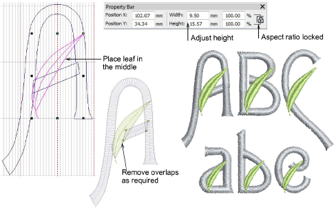

# Edit the font

Duplicate the leaf and resize in the Property Bar. Making sure the aspect ratio is locked, adjust heights as necessary – in this case, 15mm for uppercase ornaments and 10mm for lowercase. Choose the colors you want to use for leaf and letters – e.g. moon green and powder blue. Place the ornament as shown. Duplicate by right-clicking and dragging to the next letter. Remove overlaps as required.

## Related topics...

- [Reshaping embroidery objects](../../Modifying/reshape/Reshaping_embroidery_objects)
