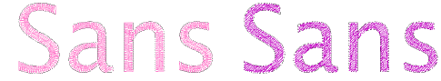

# Experiment with conversion settings

|  | Use Toolbox > Lettering to add TrueType lettering directly on-screen. Right-click to set the formatting values for new or selected lettering objects. |
| -------------------------------------- | ----------------------------------------------------------------------------------------------------------------------------------------------------- |

The process of converting TrueType fonts to embroidery begins by converting individual letters ‘on-the-fly’ and experimenting with conversion settings.

## To convert TrueType letters on-the-fly...

1Right-click the Lettering icon to access object properties.

2Select a TrueType font from the droplist.

3Enter some sample text which mixes capitals and lower-case letters, with and without extenders.

4Click TTF Conversion to access conversion settings.

5First of all, select a lettering style, if available, from the Style list – e.g. Regular, Bold, Italic. The entire embroidery font will be created in the selected style. This option may not be available for all fonts.

6Specify whether to convert as Turning Strokes or Complex Fill.

This will depend in part on font type – whether serif or non-serif, whether script or block. If you want stitching to follow letter contours, select Turning Strokes. The Complex Fill option provides a single fixed [stitch angle](../../glossary/glossary).

7If in doubt, experiment with both settings. Create a sample of each – fixed and turning. Because lettering is converted on-the-fly, you can select the generated lettering and further adjust settings.

8With the Complex Fill option, try adjusting stitch angle and regenerating the sample until you find the optimum angle.

9With the Turning Strokes option, there are many more settings. Presets are automatically adjusted according to selected font characteristics – e.g. whether serif or sans serif, whether block or script. Try the defaults to start with.

10Zoom in to study the stitching and object formation. Decide which style to use – turning or complex fill. If unsatisfied with generated Turning Strokes, experiment further with the settings. See below.

## Related topics...

- [Creating lettering with CorelDRAW Graphics](../../Lettering/lettering_create/Creating_lettering_with_CorelDRAW_Graphics)
- [Refine turning stroke options](Refine_turning_stroke_options)
