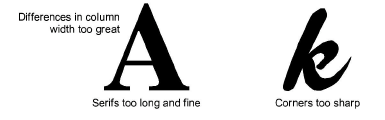
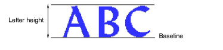
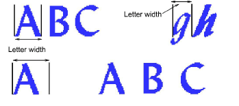

# Font considerations

You can use [artwork](../../glossary/glossary#artwork) to create font letters in the same way as you do other objects. Before digitizing, however, establish whether the letter shapes are suitable for embroidery, and determine reference height and baseline for the font.

## Letter shapes

For best results, letter columns should be of similar width, without tight curves or sharp corners, or very fine, very wide, or curved serifs.

## Reference height and baseline

Reference height is the maximum height of capital letters. Although there may be subtle differences between upper and lower case letters, it is a useful guide for digitizing.

Place letters along a standard baseline to help digitize at a standard height. Draw in the baseline if you are digitizing from [artwork](../../glossary/glossary#artwork), or use a grid line as your guide. Descenders in letters such as y or g generally fall below the baseline.

::: tip
Use E or H as reference letters to determine the height and baseline for the font. These letters work well because they sit on the baseline and do not extend above the standard cap-height.
:::

## Letter spacing and width

Letter width varies with letter shape and spacing. When you digitize letters, you enter two reference points to mark the width.

Default spacing affects ‘kerning’ or spacing across all letters. This is set when packing the font. It is not advisable to add spacing around individual letters when digitizing reference points.

::: tip
Certain digitizing rules apply when creating script fonts, mainly to ensure that the tail of each letter joins seamlessly with the next letter.
:::

## Letter sequencing

Letter stitching sequence is based on the join type used when saving the font. If you use Closest Join or Bottom Join, EmbroideryStudio applies automatic [branching](../../glossary/glossary#branching). This determines where each stroke starts and ends, adding travel runs as necessary.

However, it is good practice to digitize strokes in the direction they are most likely to be stitched in. It is also important to specify the stroke order as this is maintained when sequencing is calculated.

If you want to specify the stitching sequence and connectors yourself, digitize the letter exactly as you want it stitched. You then need to select As Digitized as the font join method.
