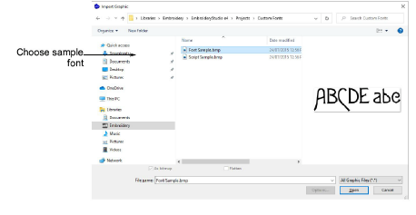
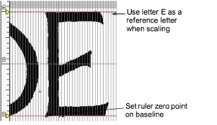

# Import & size the backdrop

|  | Use Standard > Import Graphic to import vector graphic or bitmap image into current design |
| ---------------------------------------------- | ------------------------------------------------------------------------------------------ |

Click the Import Graphic icon or select File > Import Graphic and navigate to Projects > Custom Fonts within the installed C:\\Users\\Public\\Public Embroidery\\EmbroideryStudio e4 folder. If necessary, select BMP from the Files of Type list. Select ‘Sample Font.bmp’ and click Open. Save the design to your local hard drive as an EMB file.

Use the grid to size the backdrop. Remember, we are creating a font for a nominal height of 20 mm. Use E as a reference letter to determine the height of the font.

## Related topics...

- [Insert bitmap images](../../Automatic/bitmaps/Insert_bitmap_images)
- [Scaling objects](../../Modifying/transform/Scaling_objects)
