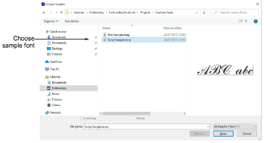

# Import & size the backdrop

|  | Use Standard > Import Graphic to import vector graphic or bitmap image into current design |
| -------------------------------------------------------- | ------------------------------------------------------------------------------------------ |

Click the Import Graphic icon or select File > Import Graphic and navigate to Projects > Custom Fonts within the installed C:\\Users\\Public\\Public Embroidery\\EmbroideryStudio e4 folder. Open the ‘Sample Script.bmp’ and set up the grid. Check the backdrop height. It should be 25mm which is the font size we are going to make. Save the design as an EMB file.

