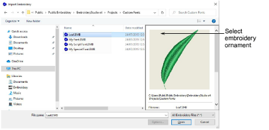

# Import the embroidery ornament

Import the embroidery ornament using the File > Import Embroidery command. Navigate to Projects > Custom Fonts folder. If necessary, select EMB from the Files of Type list. Select ‘Leaf.Emb’.

