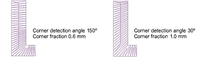

# Refine turning stroke options

With Turning Strokes, preset values are automatically adjusted according to selected font characteristics – e.g. whether serif or sans serif, whether block or script. If unsatisfied with the presets, experiment further with the below settings.

Tip: Click Suggest Values if you need to return to suggested settings at any time.

## Match ends

Select the Match Ends checkbox to keep stitch angles parallel to the end of the stroke. This option will override any corner detection and corner fraction where parallel stitching applies.

Stitch angles in strokes should normally be perpendicular to the stroke, but the exceptions are letters like K, X, Y with short slanted strokes. In these cases it is better to keep the stitch angle parallel to the end of the stroke.

## Separate serifs

Select the Separate Serifs checkbox if you are converting a serif font.

As the serifs are made into separate strokes, this option is better used with larger lettering where serifs are greater than 0.8 mm in breadth.

## Break angle

Select the Break Angle checkbox to apply a cap to sharp angles. This effect is similar to [Smart Corners](../../glossary/glossary) – if the stroke bends sharply, like the letter A or V, it will be split or capped.

## Corner detection

Fine-tune processing of corners with these settings:

- Corner Detection Angle specifies the angle which will identify a corner in the letter. This is more important for getting well-defined small letters. Note, however, that EmbroideryStudio automatically inserts stitch angles where needed in order to obtain smooth turning stitches. These generally occur at locations where the shape changes significantly in direction or width.
- Corner Fraction specifies [fractional spacing](../../glossary/glossary) at corners. It is used to create smooth transitions of stitch angle at corners, shape ends, or where a shape changes in width or curvature significantly.

## Create overlaps

Select the Create Overlaps checkbox to prevent gaps forming between segments. You can fine-tune the overlaps by setting values in the ‘T’ junctions and ‘O’ junctions fields.

