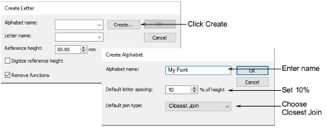
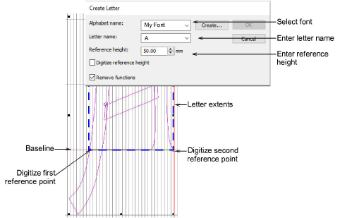

# Save custom font & letters

When you save a new letter, you need to create a font for it, give it a name, specify its height, and indicate whether to preserve any [machine functions](../../glossary/glossary). You also need to set letter width by marking reference points on-screen.

## Create font

Select a letter and choose Object > Create Letter. Since this is the first letter to be saved, create and name a custom font. Click Create in the Create Letter dialog to access the Create Font dialog. Enter a font name – e.g. ‘My Font’. Set default letter spacing – e.g. 10% – and select Closest Join as the default join type.

## Save custom letter

Back in the Create Letter dialog, enter a name for the letter – e.g. ‘A’. Set the Reference Height to, say, 20mm. Digitize reference points. Imagine there is a box around the letter marking the extents. Reference points are where the box and the baseline meet.

Add more letters to your custom font in the same way.

## Related topics...

- [Create custom letters](../../Lettering/lettering_custom/Create_custom_letters)
- [Save custom letters](../../Lettering/lettering_custom/Save_custom_letters)
- [Save custom fonts](../../Lettering/lettering_custom/Save_custom_fonts)
- [Manage fonts](../../Lettering/lettering_custom/Manage_fonts)
