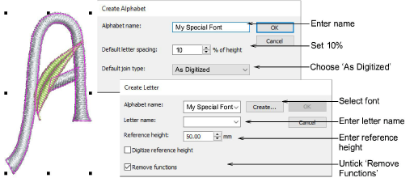

# Save custom font & letters

Select all components of the custom letter and save using the Object > Create Letter command. Create a new font for your multicolor custom font – e.g. ‘My Special Font’. This time choose As Digitized as the default join type. Enter letter name and reference height as before, and untick the Remove Functions checkbox. We want to preserve the color changes.

## Related topics...

- [Create custom letters](../../Lettering/lettering_custom/Create_custom_letters)
- [Save custom letters](../../Lettering/lettering_custom/Save_custom_letters)
- [Save custom fonts](../../Lettering/lettering_custom/Save_custom_fonts)
- [Manage fonts](../../Lettering/lettering_custom/Manage_fonts)
