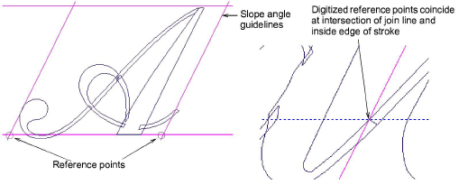
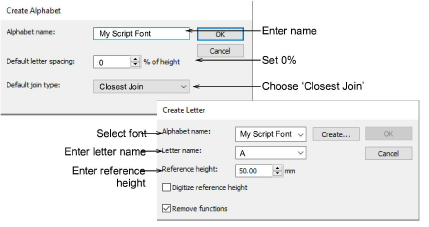

# Save custom font & letters

To define reference points for italic fonts, draw a slope angle guideline and clone it to mark letter extents as shown. The guideline for the reference points always intersects the inside edge of the join as shown.

As before, select a letter and apply the Create Letter command. Create and name your script font. Set default spacing to 0% and select Closest Join as the default join type. Enter the letter name and set reference height to 25 mm. As always, digitize reference points.

## Related topics...

- [Create custom letters](../../Lettering/lettering_custom/Create_custom_letters)
- [Save custom letters](../../Lettering/lettering_custom/Save_custom_letters)
- [Save custom fonts](../../Lettering/lettering_custom/Save_custom_fonts)
- [Manage fonts](../../Lettering/lettering_custom/Manage_fonts)
