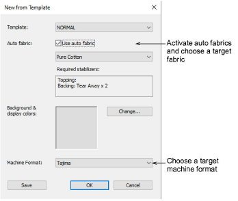

# Set fabric, background & machine format

|                  | Use Standard > New to start a blank design based on the currently selected template. Hold down Shift and click to open New from Template dialog. |
| ---------------------------------------------------- | ------------------------------------------------------------------------------------------------------------------------------------------------ |
|  | Click View > Show Product to toggle product image on/off. Right-click to open the Product Visualizer docker.                                     |

Open EmbroideryStudio from the desktop icon or Windows Start menu. From the Home screen, click New from Template. Otherwise, select File > New from Template or, holding down the Shift key, click New. Since we are stitching out on a polo shirt, choose ‘Pure Cotton’ (the default). Select a suitable machine format – e.g. Tajima – and click OK.

