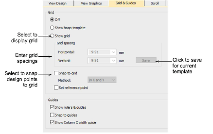

# Set up grid & guides

First we need to set up a grid to assist when digitizing embroidery letters. Guidelines also help when setting reference points. Set up grid spacing in the Options dialog via Setup > Options > Grid & Guides. Turn on Snap to Guides. Set vertical spacing to 10mm and horizontal spacing to 0.50 mm. The narrow horizontal spacing helps to digitize more accurate reference points.

Tip: If you are planning to do more custom font digitizing, it may be worth setting up a template dedicated to the task.

## Related topics...

- [Grid display options](../../Setup/settings/Grid_display_options)
- [Working with templates](../../Digitizing/properties/Working_with_templates)
