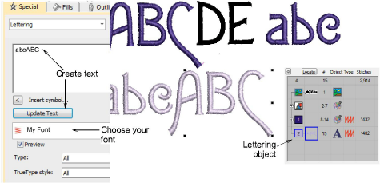

# Test the font

|  | Use Toolbox > Lettering to add lettering directly on screen. |
| ------------------------------------------------ | ------------------------------------------------------------ |

Once you have finished packing it, test your custom font by creating embroidery lettering via Object Properties > Lettering. Choose your custom font from the dropdown menu.

Tip: Compare your design with the sample ‘My Font.EMB’ included in the Projects > Custom Fonts folder.

## Related topics...

- [Create lettering with object properties](../../Lettering/lettering_create/Create_lettering_with_object_properties)
