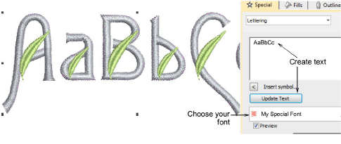
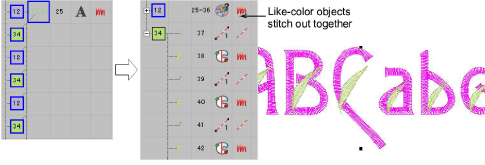

# Test the font

|  | Use Toolbox > Lettering to add lettering directly on screen. |
| ------------------------------------------------ | ------------------------------------------------------------ |

Again test your custom font via Object Properties > Lettering. Choose your custom font from the dropdown menu.

Notice that the lettering object preserves the ‘as digitized’ color changes within each letter. Use the Break Apart command to resequence like-color objects in the Color-Object List so they stitch out together.

::: tip
Compare your design with the sample ‘My Special Font.EMB’ included in the Projects > Custom Fonts folder.
:::

## Related topics...

- [Create lettering with object properties](../../Lettering/lettering_create/Create_lettering_with_object_properties)
