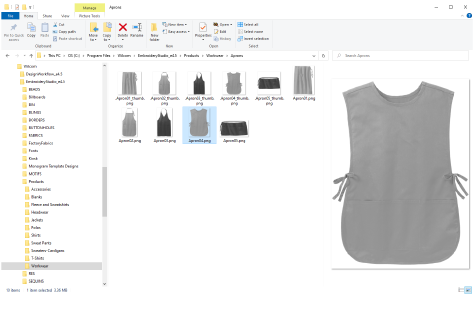

# Asset Management

EmbroideryStudio allows you to create files or ‘assets’ of various kinds during normal use. The most important of these are your actual embroidery designs. But there are other assets you may create, such as design templates, custom motifs and fonts, etc. These are preserved from installation to installation, whether installing a new version of EmbroideryStudio or a software update.

It’s a good idea to familiarize yourself with the locations and file names of your custom assets for various reasons...

- In the first instance, you should back up your custom assets in case of computer crash.
- Also, you may want to share assets with other EmbroideryStudio users, or install third-party assets such as custom fonts.
- Finally, if you want to install your software to a new computer, you will need to manually copy the contents of your asset folders to the new locations.

::: tip
If you are installing your existing setup to a new PC, it’s a good idea to create a single ZIP file of all your custom data and pre-install it to the new computer before installing EmbroideryStudio.
:::

## Related topics...

- [Custom assets in EmbroideryStudio](Custom_assets_in_EmbroideryStudio)
- [Custom asset locations](Custom_asset_locations)
- [Navigating to assets](Navigating_to_assets)
- [Personal designs & artwork](Personal_designs_artwork)
- [Showing hidden folders](Showing_hidden_folders)
