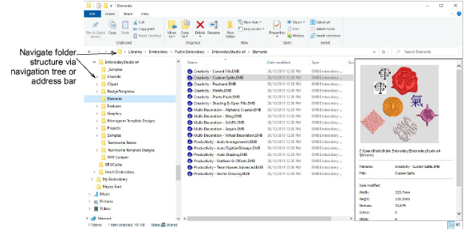

# Navigating to assets

Using File Explorer, you can navigate to the precise location of your EmbroideryStudio assets with the navigation tree on the left of the window, or simply by typing or copying the path name into the address field and pressing Enter.

Whenever you install updates or upgrades to your existing software, the above folder structure, together with any custom assets, will be preserved. However, if you install your software to another PC, you will need to manually copy the contents of these folders to the new location.

Note: The C:\\ProgramData folder may be hidden on some PCs depending on the permissions of the user who is logged in. [See Showing hidden folders for details.](Showing_hidden_folders)
