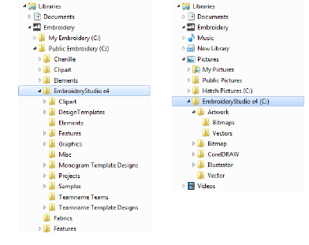

# Personal designs & artwork

Amongst your most important assets are of course your embroidery designs and any artwork files you may use. These can potentially be saved anywhere on your system. By default however...

- Any designs, cutting files, or machine files that you save from EmbroideryStudio will be saved by default to the ‘Public Embroidery’ folder at this location ...

C:\\Users\\&lt;USER&gt;\\Public Embroidery\\EmbroideryStudio\\

- Similarly, any artwork you save from EmbroideryStudio will be saved by default to the ‘Pictures’ folder at this location...

C:\\Users\\&lt;USER&gt;\\Pictures\\EmbroideryStudio\\

Whenever you install updates or upgrades to your existing software, the folder structure will be preserved. However, if you install your software to another PC, you will need to manually copy the contents of the ‘Embroidery’ and ‘Pictures’ folders to the new location.
