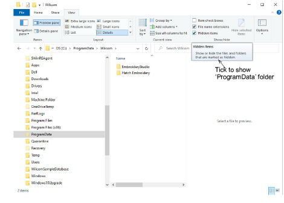

# Showing hidden folders

If you need to manually copy the contents of your asset folders to a new location, you may find that the C:\\ProgramData folder is hidden on your PC, depending on the permissions of the login you are using.

## To show hidden folders...

- Open the View tab in File Explorer as shown.

- Tick the Hidden files option. This will reveal the ‘ProgramData’ folder and all its contents.
