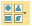
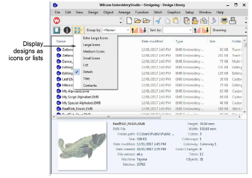

# Change design display

|  | Use View > Change View to select thumbnails only, thumbnails with stitching details, or summary information only. |
| ---------------------------------------- | ----------------------------------------------------------------------------------------------------------------- |

Use the Manage Designs toolbar to control display of the navigation pane as well as thumbnail appearance. Use the Change View droplist to display designs in the preferred format.

Tip: The Design Library display can be refreshed with a simple F5 keypress, the same as File Explorer.
