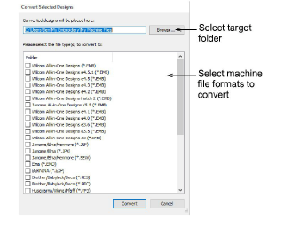

# Converting designs

|  | Use Manage Designs > Convert Selected Designs to convert the design selected in the embroidery library into different machine file types. |
| ---------------------------------------------------------------- | ----------------------------------------------------------------------------------------------------------------------------------------- |

By default EmbroideryStudio saves designs to its native EMB format. This contains all information necessary both for stitching a design and for later modification. The Design Library conversion function allows you to batch-convert to and from all EMB and other supported design file types. It also batch-converts many machine file formats such as DST, EXP, SEW.

## To convert designs...

- Select the file(s) to be converted and click the Convert Selected Designs icon. The dialog lists all machine file formats supports by the software.

- Select the file types you want to convert to.
- Click Browse to locate a destination folder for the converted designs.
- Click Convert to start the conversion. The converted designs will be stored in the nominated folder.

## Related topics...

- [Send designs to Connection Manager](../../Production/output/Send_designs_to_Connection_Manager)
- [Machine Files](../../Production/convert/Machine_Files)
