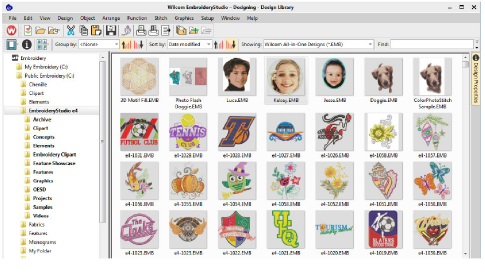

# Design Management

Design Library is a design management tool. Use it to browse design and artwork files stored on your PC or local network. Design Library capabilities make it fast and practical for daily commercial use, avoiding the need to switch to and from File Explorer. It recognizes all file formats used by EmbroideryStudio. It also makes it easy to search, sort and browse all embroidery designs on your network.

If you are already familiar with File Explorer, the interface will be quite intuitive to you. But there are some differences. Design Library is a ‘virtual library’ in that any designs on your system can be located and displayed within the navigation pane. Any folder containing embroidery designs which resides on your hard disk, external storage device, or local network can be included in the navigation pane. In a nutshell, Design Library lets you:

- Search for designs – including artwork files – anywhere on your local hard drive, network drives, or external devices such as USB or ZIP drive.
- Search by various means, including summary information such as design title, subject, authors, tags, etc. Order information can also be associated with any supported design file.
- Preview design information in the preview pane or Design Information docker.
- Create an organizing structure for easy categorization. Add to or remove design folders from your ‘virtual library’.
- Record and manage quotes, orders, and approvals.
- Batch-convert selected design files to all commercial embroidery formats such as DST, EXP, SEW, and others.
- Print selected designs or send them for stitchout to embroidery machine or to folders which machines can access for stitching.
- Use Design Library to handle quotes, orders, and approvals.

Caution: Included artwork (clipart) and embroidery designs can only be used for personal use – i.e. they cannot be commercially sold in any form. Changing the medium – i.e. clipart to embroidery or embroidery to clipart – does not remove copyright protection.

Note: CorelDRAW® needs to be registered before it can be used by EmbroideryStudio. Registration gives you access to the latest CorelDRAW® updates. It also provides CorelDRAW® Standard Membership which gives you access to content – clipart, fonts, stock photos, templates – via Corel CONNECT.

## Related topics...

- [Design library layout](Design_library_layout)
- [Viewing designs in network folders](Viewing_designs_in_network_folders)
- [Opening designs from Design Library](Opening_designs_from_Design_Library)
- [Viewing & managing design information](Viewing_managing_design_information)
- [Locating designs in the library](Locating_designs_in_the_library)
- [Managing quotes & orders](Managing_quotes_orders)
- [Converting designs](Converting_designs)
- [Outputting selected designs](Outputting_selected_designs)
