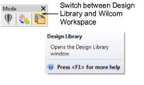
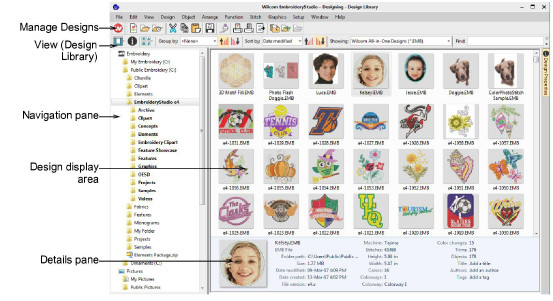

# Design library layout

The Design Library is accessed from the Mode toolbar.

The library has five main components – toolbars, navigation pane, design display area, details pane, and Design Information docker. The appearance will differ somewhat depending on your operating system.

Library components are summarized as follows...

| Component                 | Function                                                                                                                                                                                                                                                                                                                                                                    |
| ------------------------- | --------------------------------------------------------------------------------------------------------------------------------------------------------------------------------------------------------------------------------------------------------------------------------------------------------------------------------------------------------------------------- |
| Navigation pane           | The navigation pane in the Design Library is not an exact duplicate of your File Explorer folder structure. It is selective in that it only contains folders relevant to embroidery design and multi-decoration. Select and add any folder on your PC or network to view supported file types.                                                                              |
| Design display area       | The design display area shows any designs in selected folders corresponding to the filter selected or search criteria entered in the View (Design Library) toolbar. Use the toolbar to filter the design display. Right-click selected designs to access a popup menu. Use it to cut, copy and delete without leaving the software. Use it also to zip designs and folders. |
| Details pane              | When a design is selected, summary information is displayed in the preview pane.                                                                                                                                                                                                                                                                                            |
| Design Information docker | Check design details via this docker. This is always advisable prior to design approval or stitchout. Summary and order information may be provided by the digitizer or sales team. This information can be printed with approval sheets and production worksheets.                                                                                                         |
| Toolbars                  |                                                                                                                                                                                                                                                                                                                                                                             |
| Mode                      | Switch to Wilcom Workspace to digitize and edit embroidery designs.                                                                                                                                                                                                                                                                                                         |
| Manage designs            | Open selected or recent designs, cut, copy and paste them, convert them, print them, or output them to any connected embroidery machine or data media.                                                                                                                                                                                                                      |
| View (Design Library)     | Search or sort the entire embroidery library or any chosen folders on any criteria selected. Find and manage folders containing designs.                                                                                                                                                                                                                                    |
