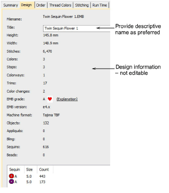

# Design tab

Select the Design tab to view design details such as height, width, stitch count and colors. The data is extracted from the design file and, apart from design title, cannot be modified.

Fields include:

| Field          | Description                                                                                                                                                                                                                                                  |
| -------------- | ------------------------------------------------------------------------------------------------------------------------------------------------------------------------------------------------------------------------------------------------------------ |
| Filename       | File name of the selected design. This will often be a number or alphanumeric format for easy cataloging.                                                                                                                                                    |
| Title          | Defaults to filename. Add a more descriptive name for easy searching. This name appears on the approval sheet or worksheet.                                                                                                                                  |
| Height / width | Total height and width of design extents.                                                                                                                                                                                                                    |
| Stitches       | Total stitch count for design.                                                                                                                                                                                                                               |
| Colors         | Number of thread colors involved in the design.                                                                                                                                                                                                              |
| Stops          | Normally color changes are associated with Stop functions. Depending on machine format, however, the design may include an additional last stop to ensure the machine returns to the starting needle for the next run.                                       |
| Colorways      | Number of colorways in the design.                                                                                                                                                                                                                           |
| Trims          | Number of trims in the design. Generally, you will try to minimize the number of trims.                                                                                                                                                                      |
| Color changes  | Number of color changes required to stitch out design.                                                                                                                                                                                                       |
| Appliqués      | Number of appliqué objects in the design (if any).                                                                                                                                                                                                           |
| Sequins        | Number of sequins in the design (if any).                                                                                                                                                                                                                    |
| Bling          | Number of bling objects in the design (if any).                                                                                                                                                                                                              |
| EMB grade      | While embroidery files are broadly classified as ‘design’ (oultine) or ‘machine’ (stitch), the software internally tags each as belonging to one of four types – native design (A), imported outlines (B), processed stitches (C), or imported stitches (D). |
| EMB version    | The version of EmbroideryStudio the file was created in – e.g. ES e4.                                                                                                                                                                                        |
| Machine format | The current machine format applying to the file. This generally corresponds to the target machine last used to stitch out the design.                                                                                                                        |
| Objects        | Indicates total number of [objects](../../glossary/glossary#objects) in the design.                                                                                                                                                                          |
| Sequin details | Lists any sequins used in the design and their respective numbers.                                                                                                                                                                                           |

## Related topics...

- [Embroidery machine formats](../../Basics/basics/Embroidery_machine_formats)
- [Design Hooping](../../Production/hoops/Design_Hooping)
- [Using automatic connectors](../../Quality/connectors/Using_automatic_connectors)
- [Embroidery file formats](../../Basics/basics/Embroidery_file_formats)
