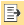
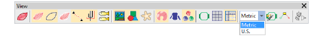
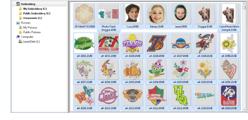
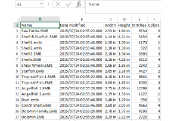

# Export design lists

|  | Use Manage Designs > Export Design List to export selected files to Tab and CSV (Comma Separated Value) formats suitable for use by most spreadsheets. |
| ---------------------------------------------------- | ------------------------------------------------------------------------------------------------------------------------------------------------------ |

The Export Design List option can be used to print design lists for selected folders. This option allows you to create a simple design report which can easily be imported into a spreadsheet. You may want to use this in order to manage designs by file name.

## To export a design list...

- Preset the measurement units you want to use – metric or U.S.

- Open the Design Library and select a design folder.
- Sort and filter the designs to export.

- Select all files to include in the export list.
- Click the Export Design List icon and choose a location to save the list. Choose whether to save as a tab-delimited or comma-separated text file.
- Open the text file in a spreadsheet for further sorting and printing.

::: tip
Designers frequently want to distribute designs for viewing in real colors, in TrueView™ or otherwise, with or without fabric backgrounds. Screen images can be captured in PNG format and send as email attachments.
:::
