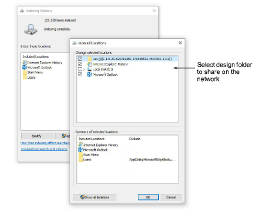

# Fast searching on shared network drives

For businesses with multiple computers reading and writing EMB or machine format designs, there is usually a need to store designs in shared network folders. You may want to set up a company server as a central repository for all design files. Connect any folders on the server to each client PC via Design Library. Design Library relies on Windows indexing to ensure fast searching.

## To set up fast searching on shared network drives...

- For the Windows file server, make sure you have the Windows Search service running. You will need a minimum of Windows Server 2008 on the server to enable fast-search indexing. You will also need some version of EmbroideryStudio installed.
- Add the design folder to be shared with the indexing function. Go to Control Panel > Indexing Options > Modify and select the correct path.

- Install EmbroideryStudio so that the Shell Extension is registered. This allows the server to index additional embroidery file properties.
- Once the server has finished indexing the folder, then, for every PC using the file server, add the design folder to Design Library. See above.

::: info Note
Fast searching will not work with NAS type devices as they are non-windows based operating systems.
:::
