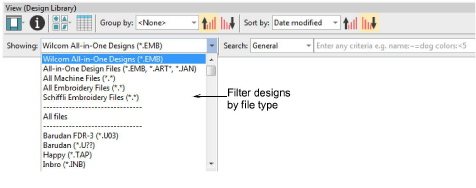

# Filtering designs

You can filter your embroidery library between file categories – design files, machine files, or all.

The Design Library can filter:

- All Wilcom-supported design files: EMB, ART, JAN
- All machine formats such as DST, EXP, JEF, etc.
- All artwork files read by EmbroideryStudio, both vector and bitmap

## Related topics...

- [Machine Files](../../Production/convert/Machine_Files)
