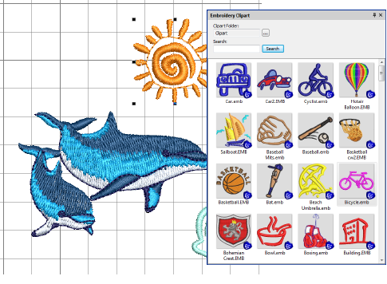

# Inserting designs with Embroidery Clipart

|  | Use Docker > Embroidery Clipart to toggle the docker display. Use it to record and recover re-usable embroidery elements. |
| ------------------------------------------------------ | ------------------------------------------------------------------------------------------------------------------------- |

The Embroidery Clipart feature is a powerful productivity tool which allows you to recycle commonly used elements. When you install EmbroideryStudio, the Embroidery Clipart feature is installed with Design Library together with a sample clipart library.

Use the Search functionality to filter your list according to name, keywords, number of colors, or number of stitches, etc. Once a suitable design element is located, simply drag-and-drop it as ‘embroidery clipart’ into the current project. Scale to suit the design. Stitch colors are added to the Color toolbar.

Use the Browse button to change to any Design Library folder on your system. For example, you may want to put together a design such as a wreath with components such as ribbons, leaves, fruit and flowers. With the clipart library this becomes a simple task.

Use Design Library to manage design elements in your clipart folders. Use Design Information to assign names and keywords to each design element you save. Keywords play an important part in organizing a growing clipart library. Finding a suitable element can take time but keywords narrow the selection. Any number of keywords can be assigned to the same clipart element. See below.

## Related topics...

- [Combining objects & designs](../../Modifying/combine/Combining_objects_designs)
- [Insert designs](../../Modifying/combine/Insert_designs)
