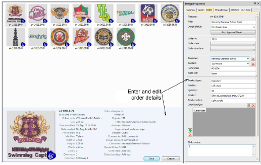

# Managing quotes & orders

The Design Library provides a practical and simple method of recording and managing quotes, orders, and approvals. It is oriented mainly to ‘Custom Logo’ commercial embroidery, where a design needs to be stitched on a specified garment in a defined location. Order information is saved directly with the design file. This allows quotes and orders to be managed via the designs they use without the complications of a separate database.

