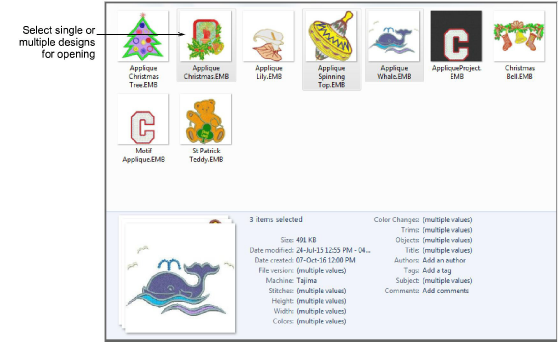

# Opening design files

|  | Use Manage Designs > Open Selected to open design(s) selected in the embroidery library. |
| -------------------------------------------- | ---------------------------------------------------------------------------------------- |

Design files, also known as ‘all-in-one’ or ‘outline’ files, are high-level formats which contain object outlines, [object properties](../../glossary/glossary) and stitch data. When you open a design file in the software, corresponding stitch types, digitizing methods and effects are applied. Design files can be scaled, transformed and reshaped without affecting stitch density or quality. After modification, you can save to any supported file format.

Using the Design Library, you have the option of opening one or more selected designs in their own design tabs. Simply select a design or designs by holding down Ctrl as you click, and then click Open Selected.

Caution: Be careful not to open too many designs simultaneously. Potentially you could select all designs in the library and click Open Selected. This operation cannot be stopped and may result in the computer running out of memory.
