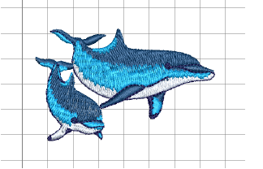

# Opening designs from Design Library

Embroidery files fall into two broad categories – ‘design files’ and ‘machine files’. Design files are ones you open and modify in Wilcom Workspace. Machine files are generally ones you send to machine for production. There is some inter-convertibility between the two formats.

## Related topics...

- [Filtering designs](Filtering_designs)
- [Opening design files](Opening_design_files)
- [Opening new files from existing](Opening_new_files_from_existing)
- [Opening machine files](Opening_machine_files)
