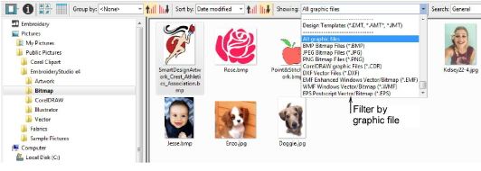

# Opening graphic files

Artwork can be opened in EmbroideryStudio in both vector and bitmap (raster) formats via Design Library. Samples of both file types are installed with EmbroideryStudio in the Pictures library as shown below.

## Extended support for CDR files

Design Library provides extended support for Corel CDR files. This includes:

- Right-click to access Windows operations – Open, Open With – directly into CorelDRAW Graphics. Or double-click to open a selected CDR file using the default template.
- Drag-and-drop from File Explorer into CorelDRAW Graphics.
- Drag-and-drop into Wilcom Workspace.
- Drag-and-drop into standalone CorelDRAW® Graphics Suite.

Note: For a full description of image file formats supported by CorelDRAW® Graphics Suite, refer to the CorelDRAW® Graphics Suite electronic User Guide available via the MS Windows® Start > Programs group. Alternatively, use the online help available from the Help menu.

## Related topics...

- [Digitizing with Bitmaps](../../Automatic/bitmaps/Digitizing_with_Bitmaps)
