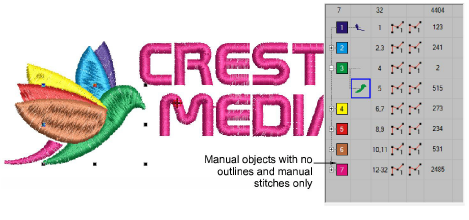

# Opening machine files

Different embroidery machines speak different languages. Each has its own commands for the various machine functions. Machine files, also known as ‘stitch files’, are low-level formats for direct use by machines. They contain information about the position, length and color of each stitch. When they are read into the software, machine files do not contain object information such as outlines or stitch types, but present the design as blocks of stitches.

While machine files are generally not suited to modification, the software can ‘recognize’ object outlines, stitch types and spacing from stitch data with some success. By default, machine files are converted to outlines and objects upon opening in the software. These ‘recognized’ designs can be scaled with stitches recalculated for the new outlines. Processing is effective for most stitch designs but cannot produce the same level of quality as original outlines and may not handle some fancy stitches.

## Related topics...

- [Machine Files](../../Production/convert/Machine_Files)
