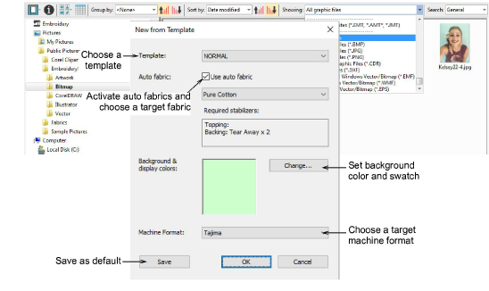

# Opening new files from existing

|  | Use Manage Designs > New from Selected to create new designs based on designs selected in Design Library. |
| -------------------------------------------------- | --------------------------------------------------------------------------------------------------------- |

Instead of opening the original designs, you can use New from Selected. The only difference for practical purposes is that this command creates a copy which opens in a new design tab, thus preserving the original design file. Left-clicking uses the default template. Right-clicking allows you to select a different template from the dialog. Selection is remembered and used the next time the command is invoked.

The New from Selected command can also be used to open graphics files, including Corel CDR. With CDR, a new file is opened in EmbroideryStudio before switching to CorelDRAW Graphics.

::: tip
If you want to open one design into another, an Import Embroidery function is available in Wilcom Workspace. Combine designs or design elements into a single design layout.
:::

## Related topics...

- [Combining objects & designs](../../Modifying/combine/Combining_objects_designs)
- [Working with templates](../../Digitizing/properties/Working_with_templates)
