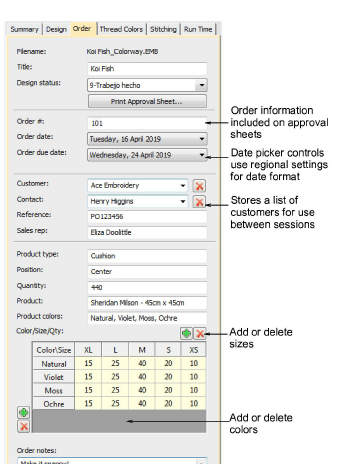

# Order tab

Order information is saved directly with the design file. This allows embroidery orders to be managed via the designs they use without the need for a commercial database. The information is included on approval sheets.

## Tips for use...

- All fields in the Design Information docker can be read and written in Design Library.
- Use Save and Reset buttons to ensure that updated fields are saved.
- The Color/Size/Qty table is included in the approval and production worksheets.
- Click buttons to add rows and columns.
- Double-click to edit labels.
- Numeric displays use locale settings.
- Date fields use locale settings.

## Related topics...

- [Managing quotes & orders](Managing_quotes_orders)
