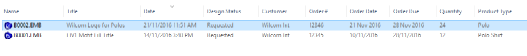

# Order tracking

Order tracking typically involves some or all of the following steps:

- Staff enter basic order details and status in EmbroideryStudio and save as an EMB design file:
- Either a new file which serves as a design request to be digitized, or
- An already digitized EMB design which is to be used for the new order.
- Design Library automatically indexes order and design details for quick search and find.
- Staff use Design Library to view and manage designs as well as quotes, orders, and approvals. Browse, list, or search for designs by:
- Customer
- Order
- Date
- Size
- Design name
- Description, etc
- Order details are printed on approval sheets and emailed for customer approval.
- Order details are printed on production worksheets for production staff.
- Staff use design status to track and manage order workflow, including list of designs:
- To be digitized
- Awaiting customer approval
- Ready for production, etc.

