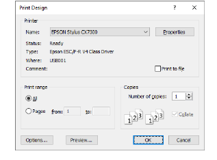

# Print design catalogs

|  | Use Manage Designs > Print Selected to Catalog to print selected designs to a catalog. |
| ---------------------------------------------------------------- | -------------------------------------------------------------------------------------- |

Printed catalogs contain thumbnails plus limited text details. You can prepare catalogs of your designs to suit your needs.

## To print a design catalog...

1. Open Design Library and filter designs as desired.

2. Select the designs you want to include in the catalog.

3. Select Manage Designs > Print Selected to Catalog. The Print Catalog Options dialog opens.

4. Adjust settings as preferred:

- Change Scale (%) to adjust thumbnail size.
- Select a catalog format – thumbnails with or without design details.
- Choose output target – PDF file or actual printer.

5. Click Print. The Print Design dialog opens.

6. Click Preview to view the catalog.

7. To print the design, choose an option:

| Option             | Purpose                                                                                                                                                                                      |
| ------------------ | -------------------------------------------------------------------------------------------------------------------------------------------------------------------------------------------- |
| Print now          | Click to send the design report to your local printer.                                                                                                                                       |
| Save as PDF        | Click to save the report as a PDF document. You are prompted to save to the hard drive or network location.                                                                                  |
| Send PDF via email | Click to send the report – usually an approval sheet – as a PDF attachment to your local email client. The PDF is automatically identified by customer name, order number, and current date. |

::: tip
If the catalog requires more than one page, you can select which page to print in the MS Windows® Print Setup dialog.
:::

## Related topics...

- [Group & sort designs](Group_sort_designs)
- [Printing design reports](../../Production/reports/Printing_design_reports)
