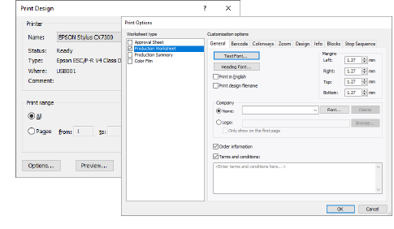

# Print selected designs

|  | Use Manage Designs > Print Selected to print designs selected in the embroidery library. |
| ---------------------------------------------- | ---------------------------------------------------------------------------------------- |

You can print worksheets for selected designs, and include thumbnails of each in the worksheet. Unlike Print Designs, this option can provide design and sewing information.

## To print selected designs...

- Sort the designs to be printed using Sort.
- Select a design and click the Print Selected icon. The Print Design dialog opens.
- To customize the printout, click Options.

- Set design report options to include the information you want in the format you require.

| Option               | Function                                                                                                                                                                                          |
| -------------------- | ------------------------------------------------------------------------------------------------------------------------------------------------------------------------------------------------- |
| Approval sheet       | This is intended for the customer, not production staff. Customers can see what they are ordering and approve accordingly.                                                                        |
| Production worksheet | This is intended for production staff. All production-related information, such as bobbin length, design size, garment fabric, etc, is provided.                                                  |
| Production summary   | This provides two summary tables of the design and associated colorways – a Colorway Summary together with a Design Summary.                                                                      |
| Appliqué patterns    | This shows appliqué patterns – cutter information – isolated from the design. These can be used as a guide to cutting out fabric pieces. They also show which appliqué pieces are to be included. |
| Color film           | Provides a list of colors in the design, together with color and stitch information for each color layer. This helps the machine operator to see each stitch color in order of stitchout.         |

- The Worksheet type panel provides options for further customization.
- Click OK and ensure correct printer settings in the MS Windows® Print Setup dialog. The dialog and the settings available vary from printer to printer. See your printer manual for details.

## Related topics...

- [Printing design reports](../../Production/reports/Printing_design_reports)
- [Customizing design reports](../../Production/reports/Customizing_design_reports)
