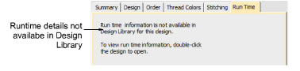

# Runtime tab

Once your machines have been defined, running times are displayed in the Design > Design Information docker Runtime tab. This tab lists available machines together with estimated runtimes based on stitch count and machine criteria. Runtime estimate, based on selected machine, can also be included in the production worksheet. This information cannot be viewed in Design Library. The design first needs to be opened in Wilcom Workspace.

## Related topics...

- [Doing runtime estimates](../../Setup/hardware/Doing_runtime_estimates)
- [Managing quotes & orders](Managing_quotes_orders)
